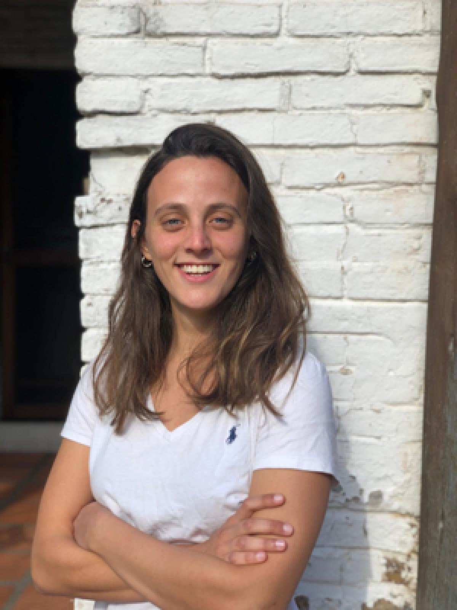
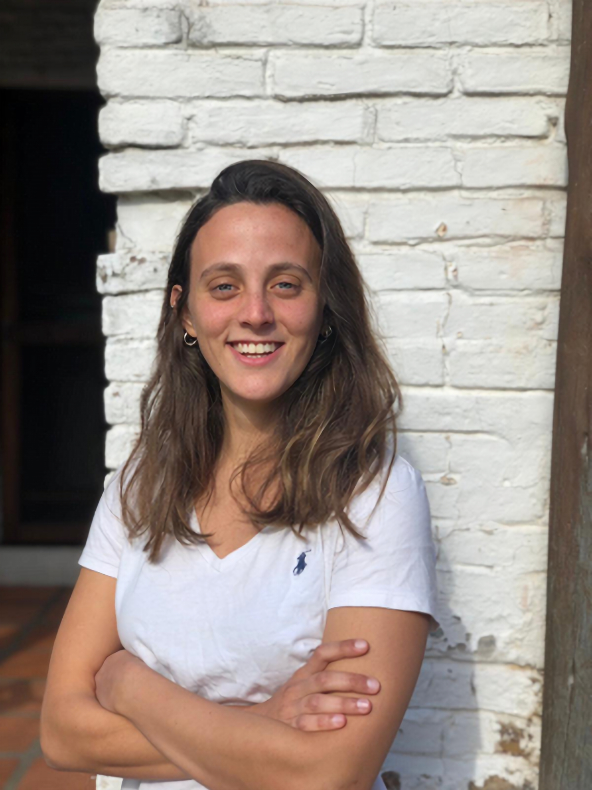

# Super-resolution

Implementaciones de distintos algoritmos de aplicacion de super-resolution a imagenes con PyTorch.

## Instalación

1 - Obtener version de python>=3.9.

2 - Crear venv con el comando `python3 -v venv .venv`.

3 - Seleccionar el venv como source con `source .venv/bin/activate`.

4 - Instalar los requerimientos con `pip install -r requirements.txt`.

5 - Descargar los pesos de los modelos de (TODO: Agregar link) y colocarlos en *super-resolution/weights/*.

6 - Correr el dashboard desde la terminal (con el venv activado) con el comando `streamlit run dashboard.py`.

## Código

El repo se divide en 3 carpetas principales: **model** y **research**.

En **research** se encuentran los scipts utilizados para entrenar y probar los paquetes.

En **model** se tienen los scripts **viz&#46;py** y **inference&#46;py** que contienen funciones generales usadas en distintas partes y una carpeta por cada modelo GAN utilizado: **SRGAN** y **ESRGAN**. En cada una de ellas se encuentra el código de las redes generativas y discriminativas, asi como el codigo de inferencia.

Estos son resultados utilizando los pesos pre-entrenados de las distintas arquitecturas probadas:

Nearest neighbour &nbsp; &nbsp; &nbsp; &nbsp; &nbsp; &nbsp; &nbsp; &nbsp; Bicubic upsampling &nbsp; &nbsp;  &nbsp; &nbsp; &nbsp; &nbsp; &nbsp; &nbsp; &nbsp; &nbsp; &nbsp; &nbsp; SRResNet &nbsp; &nbsp;&nbsp; &nbsp; 

  
&nbsp; &nbsp;
  
&nbsp; &nbsp;
  

SRGAN &nbsp; &nbsp; &nbsp; &nbsp; &nbsp;&nbsp; &nbsp; &nbsp; &nbsp; &nbsp; &nbsp; &nbsp; &nbsp;&nbsp; &nbsp; &nbsp; &nbsp; &nbsp; ESRGAN &nbsp; &nbsp;  &nbsp; &nbsp; &nbsp; &nbsp; &nbsp; &nbsp; &nbsp; &nbsp; &nbsp; &nbsp; &nbsp; &nbsp; &nbsp; &nbsp; &nbsp; Original &nbsp;&nbsp; &nbsp; 

  
&nbsp; &nbsp;
  
&nbsp; &nbsp;
  

## Entrenamiento y datasets

Se descargaron múltiples datasets de (TODO: Agregar link) y se reentrenaron ambas redes para dos casos particulares: imagenes de animales e imagenes de paisajes.

El dataset de animales consiste en (TODO: Agregar numero) imagenes de perros y gatos y el dataset de paisajes consiste en (TODO: Agregar numero) imagenes

Se entrenó en ambos casos durante (TODO: Agregar numero) epochs.

Se tienen de esta forma tres sets de pesos, uno general descargado de internet entrenado con el dataset BSDS100, uno para animales y otro para paisajes.

Se compararon las metricas de los 3 conjuntos de pesos para los 2 modelos con los 3 datasets. Se agrego como baseline un modelo SRResNet, obteniendose los siguientes resultados:
(TODO: Agregar resultados de metricas para comparar calidad de imagenes, tiempo de entrenamiento, tiempo de inferencia).

## Dashboard

Ademas de dichos resultados, se puede correr un dashboard hecho con streamlit para visualizar rapidamente resultados.
